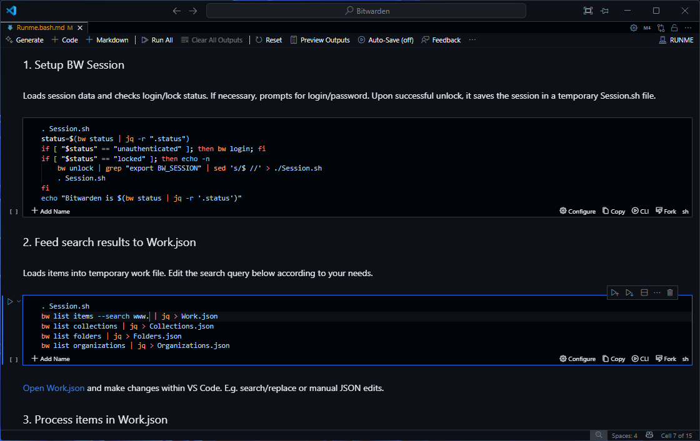

# Bitwarden Toolbox

This toolbox was developed to complement the Bitwarden CLI for mass editing large number of entries.

## Requirements
1. [Visual Studio Code](https://code.visualstudio.com/). This repo is just a VS Code project.
2. VS Code Plugin: [Runme Notebooks for DevOps](https://marketplace.visualstudio.com/items?itemName=stateful.runme).
3. Bash Shell (well supported) or PowerShell (hacky, but it works).
5. [Bitwarden CLI](https://bitwarden.com/help/cli/) installed and functional from the preferred shell environment.
6. [**./jq**](https://jqlang.org/) installed.
7. Make sure that you get a valid JSON output from your shell when running `bw status | jq`.

## Steps to Boot
1. Get VS Code if you don't have it already.
2. Checkout the code from this repo.
3. Open the folder as a project in VS Code.
4. Pick a Shell suitable for your platform. If you are on *nix system, it's Bash without any doubt! For Windows, you can still use the Bash variant if you have something like Git Bash or WSL installed. Otherwise, PowerShell fallback code works too. If Bash is picked on Windows, then set your default terminal (integrated, for workspace) to "Git Bash" or and installed "WSL Variant".

### Dashboard Variants
- [Bash Edition - Runme.bash.md](./Runme.bash.md). To run this, `.vscode/settings.json` must have `"terminal.integrated.defaultProfile.windows": "Git Bash"` or similar profile from the list of Bash shells already detected by VS Code.
- [PowerShell Edition - Runme.pwsh.md](./Runme.pwsh.md). For this, you don't have to do anything as long as pwsh is launched by default. In case it is overriden by your global settings, then in `.vscode/settings.json` set `"terminal.integrated.defaultProfile.windows": "PowerShell"`. If you have multiple flavors of PowerShell installed, then replace PowerShell name with the actual label.

## The Workflow
1. Run the 1st cell - Setup BW Session. Enter your login/password.
2. In the 2nd cell, look for the following query and make adjustments. `bw --pretty list items --search www. > Work.json`. For example, `--search accounts.` will list all items prefixed with `accounts.` from your vault, such as accounts.live.com.
3. Open the Work.json in VS Code and make your changes. Make install good linter (Prettier?) and don't break file syntax while you edit. For items you want to delete, create/set `"delete": true`.
4. Proceed to 3rd cell and run it.
5. Optionally run the cleanup routine in 4th cell. If you want to continue working on a different set of search, then skip it and go back to 2nd cell.